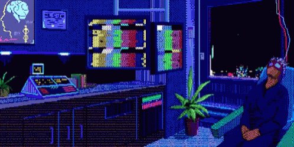

<h1 align="center">Hi 👋, I'm Siddhant Gupta</h1>
<h3 align="center">A passionate programmer from India</h3>

- 🔭 I’m currently working on **reaching and understanding new AI technologies**

- 🌱 I’m currently learning **AI,Ml and OpenCV**

- 👯 I’m looking to crack **GSoC**

- 👨‍💻 All of my projects are available at [https://github.com/sid346184?tab=repositories](https://github.com/sid346184?tab=repositories)

- 💬 Ask me about **DSA and Linux**

- 📫 How to reach me **gsid306@gmail.com**

- 📄 Know about my quality different from others [My main OS is ubuntu previous one was kali linux]

- ⚡ Fun fact **....I know how to centre a div....**

<h3 align="left">Connect with me:</h3>

<h3 align="left">Languages and Tools:</h3>

                 

